# Collin Miller - Portfolio

## Ribit Tea Demo

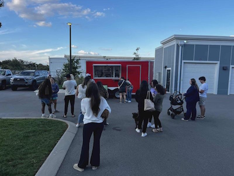
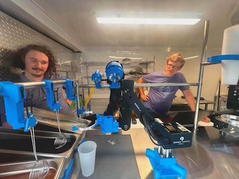

**Skills:** C++, Python, Robotics, Microcontrollers, Prototyping

A robot which automatically retrieves a cup, scoops boba into a cup, dispenses liquids into cup, seals the cup, and delivers the beverage. A computer receives orders via MQTT from the website and tracks and translates those orders into robot commands. The system incorporates a microcontroller to manage 12 DC pumps, take serial commands, retrieve temperature and load cell data, and manage temperatures. This system was demoed on October 10th 2025.

## Ribit Tea Site

| 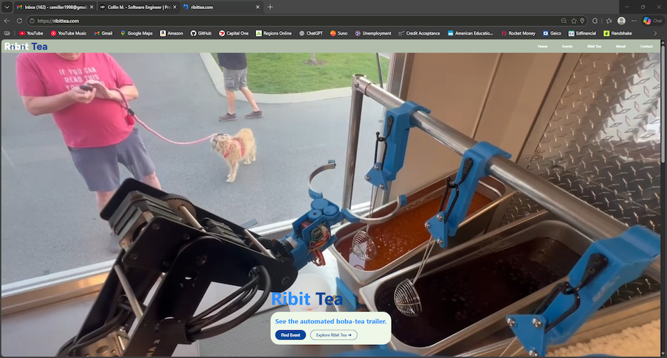 |  |
|--------|--------|
| 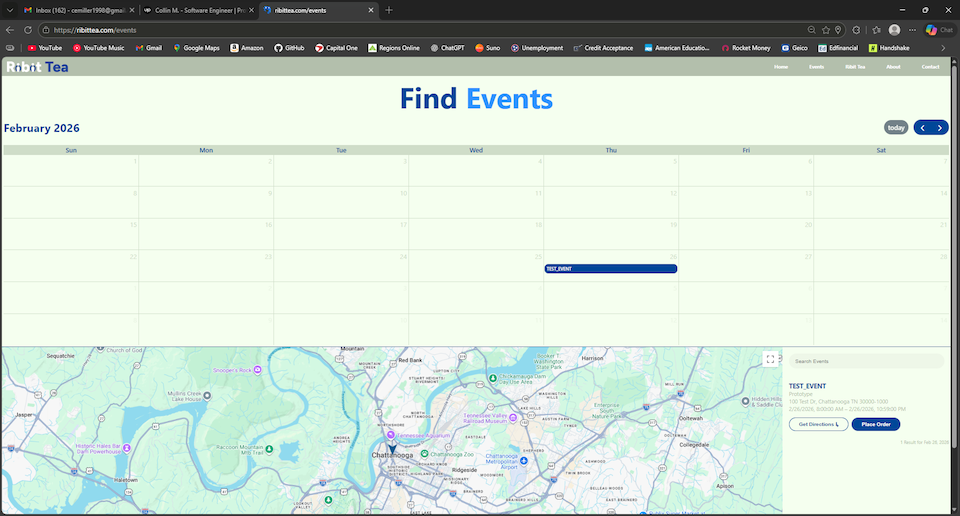 | 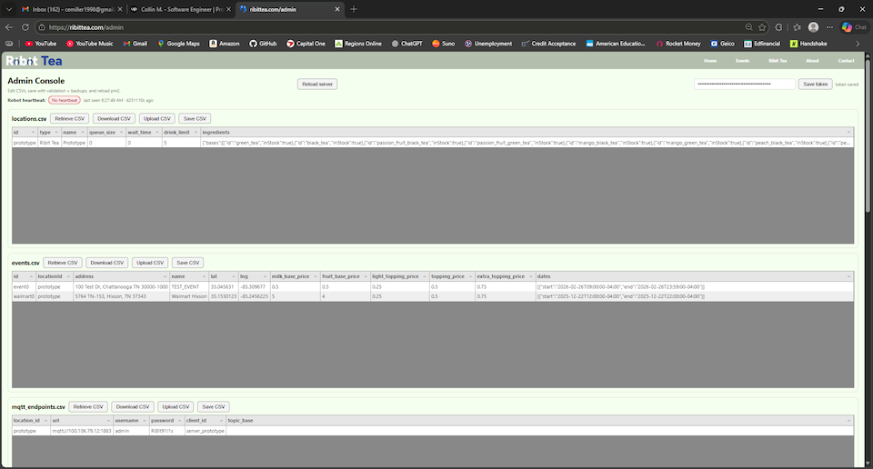 |

**Skills:** Svelte, TypeScript, REST API, Web Development, THREE.js, MQTT

I developed this website with TypeScript and Svelte. They can find locations on the site manually or scan the location's QR code to be taken directly to the order page. The order page uses THREE.js for a unique interactive 3D ordering experience. The site utilizes Stripe for payments and communicates directly with the location's computer via MQTT to send orders and get updates for the customer.

## Sightline - Operator Environmental Awareness System

|  | 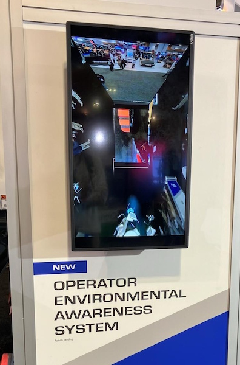 | 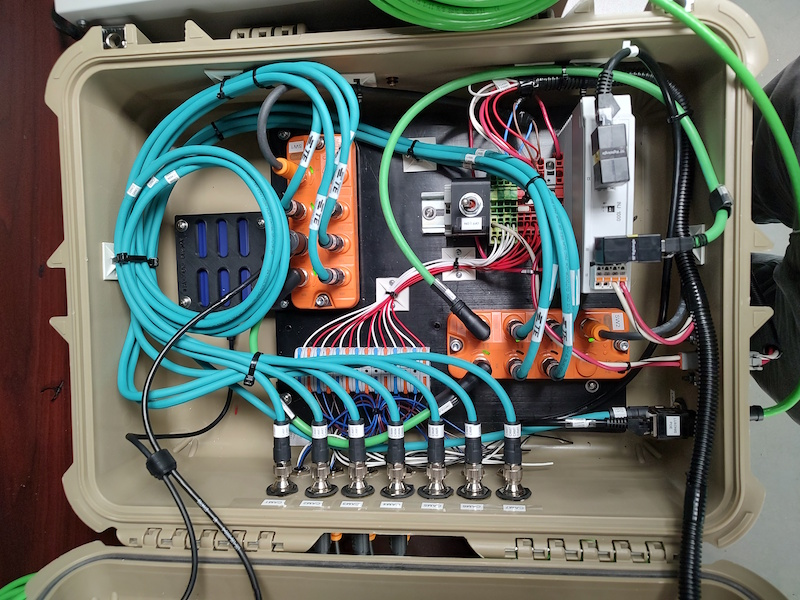 |
|--------|--------|--------|

**Skills:** Vulkan, OpenGL ES, Multithreading, C++, GStreamer, Camera Stitching, Embedded Systems, Edge AI, Ethernet

A system capable of connecting 5 industrial cameras over ethernet, connecting to an industrial embedded controller, warping and then stitching the images together, then presenting that on a display. This system provided improved operator awareness around mobile industrial equipment. The project was showcased at World of Asphalt in 2023 and is now in production.

## Stereoscopic Camera Automation

| 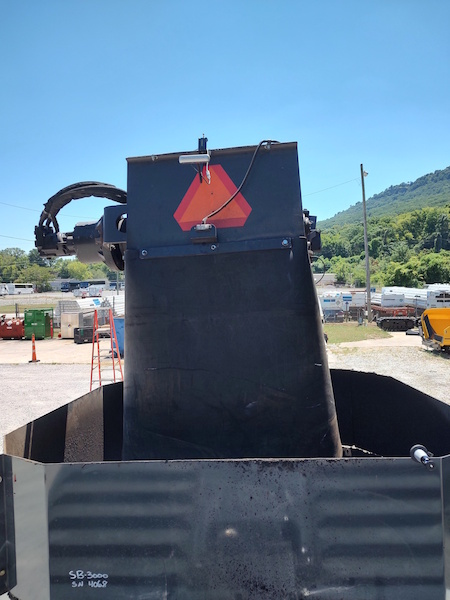 | 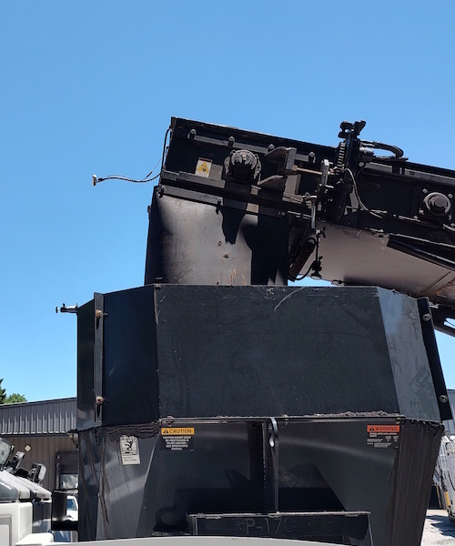 | 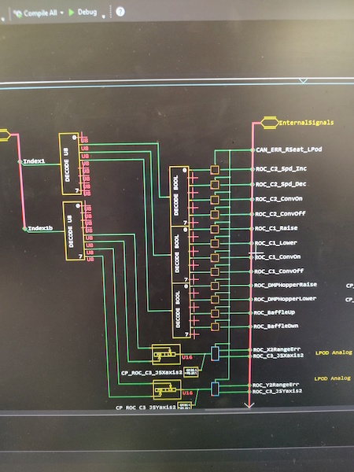 |
|--------|--------|--------|

**Skills:** Stereoscopic Depth, Computer Vision, Feature Extract/Matching, Industrial Automation

Developed a vision-assisted control system for mobile industrial equipment using stereoscopic depth sensing. Real-time depth data guided hydraulic solenoid actuation to automate a function previously performed manually, reducing operator workload and improving consistency.

## SmartEdge - Joint Detection

| 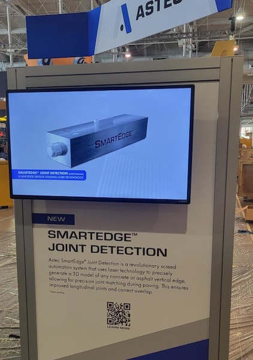 | 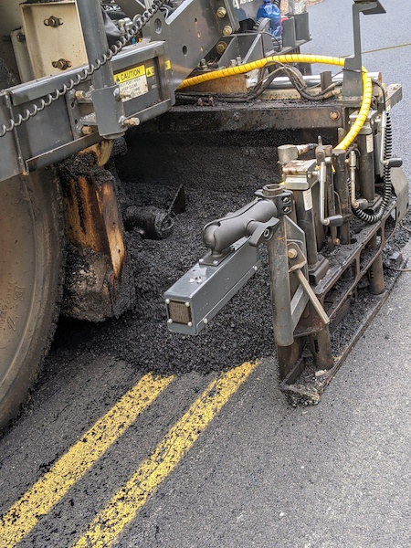 |
|--------|--------|

**Skills:** PLC Programming, HMI Programming, Structured Text, CodeSys, Laser Profilers, Industrial Automation

This project utilizes a 2D point cloud generated by a laser profiler to identify an edge along rugged terrain. The system uses this information to determine how to actuate a hydraulic system ultimately automating one of the key functions on a paving machine. This system was showcased at World of Asphalt in 2023 and is now in production.

## CAN Logger

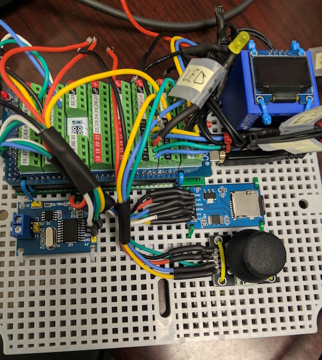

**Skills:** Microcontrollers, CAN (Controller Area Network), C++, Electronics

Connects a 24V Rugged Mega controller, a CAN transceiver, an SD card reader, an OLED screen, and a joystick to log CAN messages. This device records CAN when powered on into binary files and can also play back CAN recordings.

## NASA Psyche Satellite AR/WebXR Experience

| 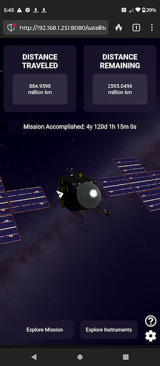 | 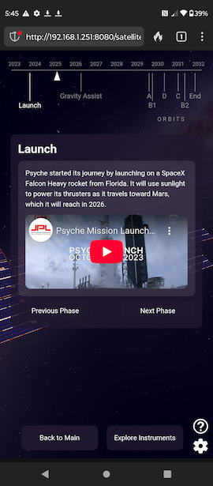 | 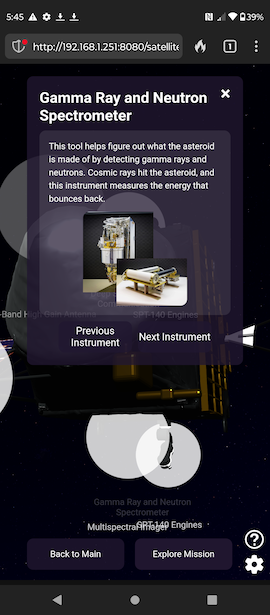 |
|--------|--------|--------|

**Skills:** JavaScript, NODE.js, THREE.js

Arizona State University senior project developed with 4 others. Developed two augmented reality web experiences for a museum, using QR codes to immerse the public in realistic space environments and an interactive UI to explore the NASA Psyche mission, its satellite, and mission lore.